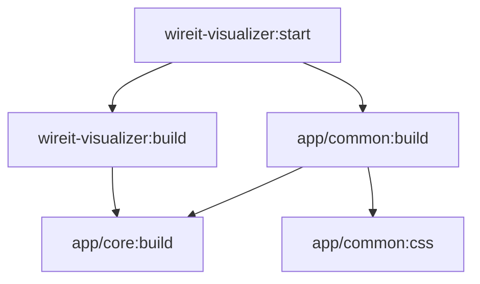

# Wireit Visualizer

Example of how to generate a visualization of a wireit project. Run `npm start` and look at port 4300. Running the visualizer on this repo produces for following visual.

```mermaid
flowchart TD;
  wireit-visualizer:start[wireit-visualizer:start] --> wireit-visualizer:build[wireit-visualizer:build];
  wireit-visualizer:start[wireit-visualizer:start] --> app/common:build[app/common:build];
  wireit-visualizer:build[wireit-visualizer:build] --> app/core:build[app/core:build];
  app/common:build[app/common:build] --> app/common:css[app/common:css];
  app/common:build[app/common:build] --> app/core:build[app/core:build];
```
