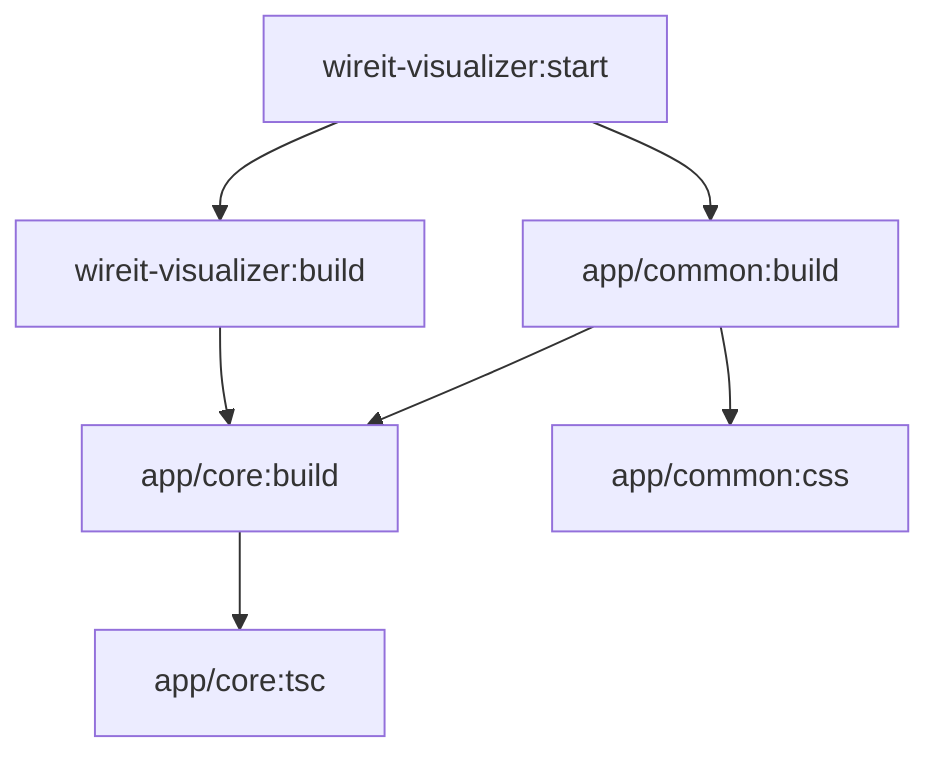

# Wireit Visualizer

```bash
npx wireit-visualizer
```

This repo is a POC for the following issue filed on the wireit repo. https://github.com/google/wireit/issues/977

Example of how to generate a visualization of a wireit project. Run `npm start` and look at port 4300. Running the visualizer on this repo produces for following visual.


