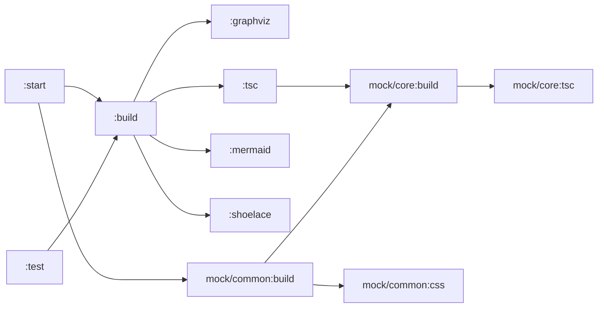

# Wireit Visualizer

Wireit Visualizer gives you the ability to generate a graph visualization of your build configuration.

```bash
npx wireit-visualizer@latest --open
```

## Options

| name   | short | description       | default |
| ------ | ----- | ----------------- | ------- |
| --port | -p    | server port       | 4200    |
| --open | -o    | auto open browser | false   |

This repo generats the following graph



This repo is a POC for the following issue filed on the wireit repo. https://github.com/google/wireit/issues/977
